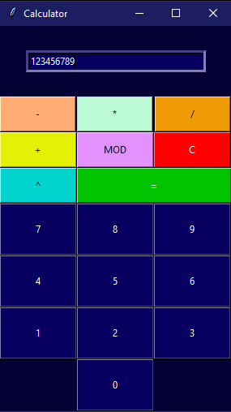

# Tkinter Calculator
Basic GUI calculator created with Python's Tkinter module. Buttons are organized according to Tkinter's grid system. The flexibility of the grid system makes it easy to add additional buttons to the calculator. Likewise, the similar function definitions ease the extensibility considerations of future feature additions or revisions. The Windows executable was created with pyinstaller (pyinstaller --onefile calculator.py).

 

